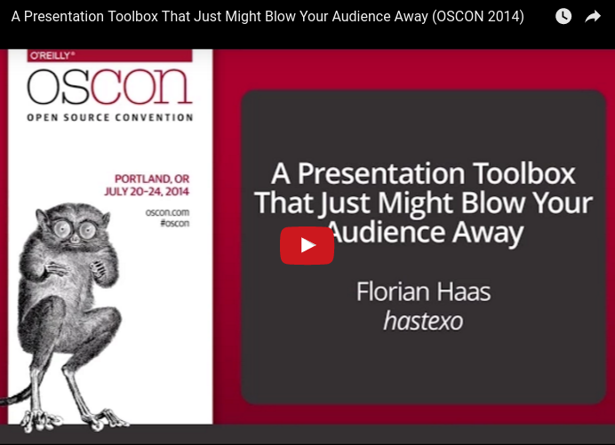

# My reveal.js presentation template

I keep this repo around as a template for presentation slide decks. It
is based on [`reveal.js`](https://github.com/hakimel/reveal.js/) by
Hakim El-Hattab (and contributors), and reflects some presentation
"rules" I've defined for myself through trial and error over a few
years:

- I use a white background, with black as the primary foreground
  color. I've found this to work best even with low-quality projectors
  and under suboptimal lighting conditions, even for talk attendees
  with reduced eyesight or seated in the very back row.

- I use sans-serif fonts
  ([Cabin](https://www.google.com/fonts/specimen/Cabin) is my current
  favorite), with a typewriter-style monospace font (currently,
  [Special Elite](https://www.google.com/fonts/specimen/Special+Elite))
  for links and highlights and another, simpler monospace font 
  ([Source Code Pro](https://www.google.com/fonts/specimen/Source+Code+Pro))
  for code snippets.

- While I'm presenting, I want the progress bar and controls off.
  They're visually distracting, and I control the presentation from a
  remote anyway.

- Whenever I want to use graphics, I let them stand on their own, with
  no text, and I use them as a full-screen background. reveal.js,
  thankfully, makes this very easy, and will "just do the right thing"
  no matter whether you're presenting on a projector, on a tablet, or
  on your phone.

- I always write my slides in Markdown, and make heavy use of speaker
  notes through the `reveal.js` notes plugin.

For more information, watch my OSCON 2014 presentation:

[](https://youtu.be/4gfsEcD9b94)

Of course, the slides for that talk use this same approach, so [they
are hosted here on GitHub Pages](http://fghaas.github.io/oscon2014-presentationtoolbox/),
and you can also examine [the source code for them](https://github.com/fghaas/oscon2014-presentationtoolbox).

## How to use

Simple: just
[fork this repo](https://github.com/fghaas/presentation-template/fork)
and drop Markdown files into `markdown` and images into
`images`. Then, fix up `index.html` to include your Markdown-authored
sections.

This repo has two branches, one named `master` and one
`gh-pages`. Make sure you do your regular work in `master`, then merge
into `gh-pages` and push both branches. Your presentation will then be
rendered to [GitHub Pages](https://pages.github.com/) at a URL of the
form:

- http://*username*.github.io/*presentation-repo-name*

You can share the URL immediately, and GitHub will host it for you,
indefinitely, for free.

### Theming

The theme is defined in `css/reveal-override.scss` using
[Sass](http://sass-lang.com/); if you update this, you will need to
re-compile into `css/reveal-override.css` via:

    $ sass css/reveal-override.scss css/reveal-override.css -t expanded -E utf-8

If you are doing continual development on the file, then run this in
the background to automatically re-compile every time the `.scss` file
is changed:

    $ sass --watch css:css -t expanded -E utf-8

If you are using GitHub Pages, make sure that the latest versions of
the generated `.css` files are committed and pushed to the remote
`gh-pages` branch.

### Diagrams

I would generally recommend that you incorporate graphs and diagrams
in your presentation using the
[SVG](https://en.wikipedia.org/wiki/Scalable_Vector_Graphics) format,
as it ensures that your graphics will look good at any screen
resolution — and it also saves bandwidth and improves loading times,
compared to high-resolution raster graphics.

My preferred way of drawing diagrams is
[draw.io](https://www.draw.io/), which has a decent
[SVG export](https://support.draw.io/display/DO/Exporting+Files#ExportingFiles-SVG)
facility. Another option is to export SVG from
[Google Drawings](https://docs.google.com/drawings), or
[Dia](http://dia-installer.de/), or even to draw SVG natively in
[Inkscape](https://inkscape.org/).

If you draw diagrams in LibreOffice Draw, see
[the documentation on incorporating LibreOffice Draw diagrams into
reveal.js presentations](LibreOffice-Draw.md).

### Running things locally

If you want to run your slides locally, rather than on GitHub Pages,
just drop them into the `DocumentRoot` of a web server, like Apache or
[`lighttpd`](https://www.lighttpd.net/).

For `lighttpd`, you may also want to set the following options:

```
dir-listing.encoding = "utf-8"
server.dir-listing   = "enable"
server.modules      += ( "mod_userdir" )
userdir.path         = "public_html"
```

Use the provided `.gitmodules` file to automatically clone local
copies of `reveal.js`,
[`qrcodejs`](https://davidshimjs.github.io/qrcodejs/), and
[`reveal.js-menu`](https://github.com/denehyg/reveal.js-menu):

```bash
git submodule init
git submodule update
```

Generate the CSS files:

```bash
sass --update css:css -t expanded -E utf-8
```

Then, create a symlink to your Git checkout in `~/public_html`, such as:

```bash
ln -s ~/git/my-presentation ~/public_html/
```

... and access your presentation from
http://localhost/~yourusername/my-presentation/


## Do you find this helpful?

If you find the content in this repo useful, it would be great if you
could let me know. You could either star this repo, or even better,
send me a [happiness packet](https://www.happinesspackets.io).
